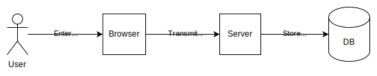
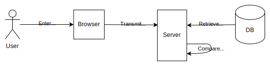

# Passwords

The original authentication method on the web, and probably still the most common, is the password.

In a password authentication system, when the user signs up:

1. The user supplies a new username and password, for example by entering it in a `<form>` element in the website.
2. The web page sends the username and password to the server, for example by submitting the form in a `POST` request.
3. The server creates a new record for this user in its database. The key is the username and the password is stored under it.



When the user signs in:

1. The user supplies the username and password.
2. The web page sends the username and password to the server.
3. The server retrieves the stored password for the user, and compares the stored password with the one it just received.



Looking at these flows, we can see some of the ways an attacker can impersonate the user.

1. **Guessing**: an attacker could try many different possible passwords for a user. Attackers typically use password lists which contain many of the most common passwords.
2. **Credential stuffing**: an attacker could buy a collection of username/password pairs from a previous data breach on a different site, and then try them on the target site in the hope that a user has used the same password for both sites.
3. **Interception**: an attacker could intercept the username and password while it is in transit from the browser to the server. One practical way to do this is to set up free Wifi hotspots in cafes or airports, and wait for victims to connect and then sign in to the target website.
4. **Database compromise**: an attacker could break into the server and retrieve the database of stored records.
5. **Phishing**: an attacker could trick the user into handing their password to the attacker. For example, an attacker might create a page that looks just like the target site's login page, and send the target user an email containing a link to the fake page, asking them to sign in.

## Password authentication flows

A password authentication system consists of four main flows:

- **Registration**
- **Sign in**
- **Password reset**
- **Password change**

### Registration

In registration, a new user supplies a new username and password. The site is very likely to ask for an email address as well, and may choose to use the email address as the username.

The site should ask for this information using an HTML `<form>` element dedicated to registration. The form should follow the practices described in [Form design](#form-design).

The form should ask for the user to enter the password twice.

When the user submits the form, the website front end should sent the username, both copies of the password, and the email address to the server, using an HTTP `POST` request. This must take place over TLS, to prevent attackers from intercepting the password in transit. See [Sending passwords](#sending-passwords).

When the server receives the `POST` request, it validates the username and password:

- The username must not match an existing username.
- The copies of the password must match each other.
- The password itself may be validated in various ways: see [Choosing passwords](#choosing-passwords) for more details.

The client may also validate data before sending it to the server, but this is only as a convenience to users: the server must still validate the data as well.

If any errors occur the server responds with an error message. Otherwise the server [stores the password](#storing-passwords) as a record in its database, keyed by the username.

#### Email verification

If the website is intending to use email in the password reset flow, then the server must also check that the email address belongs to the user signing up. To do this, the server typically generates a random token and sets it as a parameter to a verification URL:

```
https://example.org/verify?<random-token>
```

The server then sends an email to the address the user gave, which asks the user to click a link to this URL. The page can then extract that token and use it to find the user's record in the database. It can then mark the email address as verified.

### Sign in

To sign in, the user enters their username and password using an HTML `<form>` element dedicated to sign-in. The form should follow the practices described in [Form design](#form-design).

When the user submits the form, the website front end should sent the username and password to the server, using an HTTP `POST` request. Again, this must take place over TLS, to prevent attackers from intercepting the password in transit. See [Sending passwords](#sending-passwords).

When the server receives the `POST` request, the server:

- Retrieves the record for the supplied username.
- If a record exists, compares the supplied password with the value in the record.

If the comparison succeeds, the server signs the user in and returns success.

If the record was not found or the comparison fails, the server must return the same error message in both cases. Otherwise clients can determine whether an account exists, and can use this to execute further attacks.

### Password reset

### Password change

## Password managers

A password manager is an application that enables users to store passwords, so they don't have to remember them. Password managers may also autofill passwords in login forms and generate strong passwords for users.

Password managers are often implemented as browser extensions, and browsers also provide their own built-in password managers.

Typically, on a registration form, a password manager will:

- Recognize when a user is being asked to create a new password and offer to generate one.
- Recognize when a user submits a registration form and offer to store the username and password, associated with the site.

On a login form, a password manager will recognize that the user is being asked to provide their username and password, and autofill them from its storage.

Password managers bring new risks to the security landscape by providing a new target for attackers. The risks are especially pronounced when passwords are synchronized across devices or stored off the device.

However, password managers help reduce the threat of guessing and credential stuffing attacks, by making it much easier for users to have strong passwords and reducing the degree of password reuse. They can also help with phishing attacks, since a password manager will know that `paypa1.com` is not `paypal.com`, and will not autofill its login form.

So password managers provide a net security benefit, and developers should help them integrate with their websites.

## Form design

Password managers help users choose stronger passwords and reduce the likelihood of password reuse. Following the practices listed below helps password managers work with your site:

- Registration, login, password change, and password reset processes should each have their own `<form>` element.
- Forms should give a clear indication that the form has been submitted. This means either navigating to another page on submission, or simulating a navigation with `History.pushState()` or `History.replaceState()`.
- Individual `<input>` elements should use the correct `type`:
  - `"text"` or `"email"` for usernames
  - `"password"` for passwords.
- Individual `<input>` elements should use the correct `autocomplete` attribute:
  - `"username"` for username
  - `"new-password"` for creating a new password, in registration, password change, or password reset forms
  - `"current-password"` for entering an existing password, in login, password change, or password reset forms
- Forms should use hidden fields for information that the user does not have to enter, but that can provide a hint to password managers. For example, the user may not have to enter the username in a change password from, but the username can help a password manager know which password to enter.

For more information, see:

- [Sign-in form best practices](https://web.dev/articles/sign-in-form-best-practices#new-password)
- [Making password managers play ball with your login form](https://hidde.blog/making-password-managers-play-ball-with-your-login-form/)
- [Create Amazing Password Forms](https://www.chromium.org/developers/design-documents/create-amazing-password-forms/)

## Sending passwords

To reduce the risk of an attacker intercepting passwords in transit, a site must use TLS for all pages where the user enters a password.

Additionally, sites must use TLS for all pages served to a logged-in user, or an attacker will be able to intercept the session identifier and hijack the session.

Sites are very strongly encouraged to use TLS for all pages, and many features of the modern web will not work for pages not served over TLS.

TODO: better docs on how to set this up? Using Let's Encrypt or a hosting service?

## Choosing passwords

The risk of guessing attacks can be reduced if users choose stronger passwords, and the policies websites follow can help with this.

When users choose new passwords, websites should:

- Have a generous maximum password length (_at least_ 64 characters).
- Allow any Unicode characters.
- Not require specific character types (for example, don't require a mix of upper and lower case, or punctuation). Rules like this can exclude many strong password choices (for example, passphrases), and users typically follow such rules in highly predictable ways.

Additionally, websites can:

- Reduce the risk of guessing attacks by rejecting passwords found on common password lists.
- Reduce the risk of credential stuffing attacks by rejecting passwords that have been included in data breaches. For example, the [Have I Been Pwned](https://haveibeenpwned.com) website provides lists of passwords found in data breaches, and makes it available through an [API](https://haveibeenpwned.com/API/v3#PwnedPasswords).

Note, though, that this is far from a complete defense for these attacks: for example, data breaches may not be public, or may happen after the password was chosen.

Websites should also consider using a passsword strength tool like [zxcvbn](https://github.com/zxcvbn-ts/zxcvbn): note that this particular tool also checks passwords against the Have I Been Pwned data.

For more information, see:

- [OWASP Authentication Cheat Sheet](https://cheatsheetseries.owasp.org/cheatsheets/Authentication_Cheat_Sheet.html#implement-proper-password-strength-controls)
- [NIST Digital Identity Guidelines: Authentication and Lifecycle Management](https://pages.nist.gov/800-63-3/sp800-63b.html)
- [Passwords Evolved: Authentication Guidance for the Modern Era - Troy Hunt](https://www.troyhunt.com/passwords-evolved-authentication-guidance-for-the-modern-era/)

## Storing passwords

Password-based authentication must store passwords, of course, and must try to protect users even if an attacker gets access to the database containing the stored passwords.

### Hashing passwords

Websites must not store passwords in plaintext form. Instead, when the user registers with a new password (or changes their password), the password is hashed and the hash is stored. When the user presents their password on sign-in, the site:

- retrieves the hash from the database
- hashes the password provided by the user
- compares the hashes.

A hash is a _one-way function_, meaning that it's not possible to derive the original input to a hash function from its output.

This means that if an attacker gets access to the database, they will typically try to extract passwords by hashing lists of common passwords and comparing the results with the entries in the database. For this reason the hash functions chosen for password storage are intentionally slow and difficult to optimize.

Hash functions that are designed for hashing passwords typically allow you to configure the amount of work involved to create the hash, so they can be made slower or faster depending on the expected capabilites of the attacker.

### Precomputed hash tables

Rather than calculate hash tables themselves, attackers can look up the password corresponding to a hash in a precomputed table (also known as a [rainbow table](https://en.wikipedia.org/wiki/Rainbow_table)) mapping possible passwords to their hashes:

| Password | Hash        |
| -------- | ----------- |
| pa55w0rd | 56965E2A... |
| abcdef   | BEF57EC7... |
| letmein  | 1C8BFE8F... |

Although these tables may be very large, such attacks can be effective because table lookup is a fast operation.

### Salt and pepper

To defeat attacks that use precomputed hash tables, _salt_ must be added to the password before it is hashed. Salt is a random value unique to each password. It does not have to be secret: salt is stored alongside the hashed password. However, it prevents an attacker from using precomputed hash values, because the salt means that a given password will hash to a different value.

As an additional defense, websites may also add _pepper_ to the hash function's input. Unlike salt, pepper is:

- Not unique: the same value is used for all the passwords in the database.
- A secret: it must not be stored in the database itself but in a separate location such as a hardware security module (HSM).

### Hashing algorithms

Websites should use standard algorithms to hash passwords. These algorithms support all the features discussed above. The [OWASP guide to password storage](https://cheatsheetseries.owasp.org/cheatsheets/Password_Storage_Cheat_Sheet.html#password-hashing-algorithms) recommends, in order of preference:

1. [Argon2id](https://en.wikipedia.org/wiki/Argon2)
2. [scrypt](https://en.wikipedia.org/wiki/Scrypt)
3. [bcrypt](https://en.wikipedia.org/wiki/Bcrypt)
4. [PBKDF2](https://en.wikipedia.org/wiki/PBKDF2)

Websites should use password storage and verification functions provided by a reputable framework, rather than trying to implement their own. For example, [Django](https://docs.djangoproject.com/en/5.0/topics/auth/passwords/) uses PBKDF2 by default but enables you to use a different algorithm if you choose.
